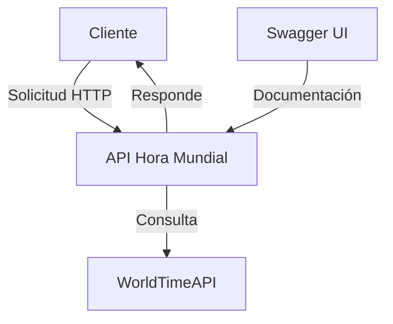

# Hora Mundial API

[](https://hub.docker.com/r/mnustes/horamundial)
[](https://opensource.org/licenses/Apache-2.0)
[](https://www.oracle.com/java/technologies/javase/jdk17-archive-downloads.html)
[](https://spring.io/projects/spring-boot)

API REST para obtener la hora actual en diferentes zonas horarias del mundo. Este servicio se conecta a una API externa para obtener la información de la hora y la devuelve en un formato estandarizado.

## 🚀 Características

- ✅ Obtén la hora actual en cualquier zona horaria soportada
- ✅ Endpoint de salud para verificación del servicio
- ✅ Documentación interactiva con Swagger UI/OpenAPI 3.0
- ✅ Manejo de errores y reintentos automáticos
- ✅ Configuración personalizable mediante variables de entorno
- ✅ Contenerización con Docker para fácil despliegue

## 🏗️ Arquitectura

### Diagrama de Componentes



### Estructura del Proyecto

```
horamundial/
├── src/
│   ├── main/
│   │   ├── java/co/unisabana/taller/horamundial/
│   │   │   ├── config/         # Configuraciones de la aplicación
│   │   │   ├── controller/     # Controladores REST
│   │   │   ├── dto/            # Objetos de Transferencia de Datos
│   │   │   ├── exception/      # Manejo de excepciones
│   │   │   ├── service/        # Lógica de negocio
│   │   │   └── HoramundialApplication.java  # Clase principal
│   │   └── resources/
│   │       ├── application.yml   # Configuración de la aplicación
│   │       └── logback-spring.xml  # Configuración de logs
│   └── test/                   # Pruebas unitarias e integración
├── .gitignore
├── Dockerfile                 # Configuración para contenedor Docker
├── mvnw                      # Maven Wrapper
├── pom.xml                   # Configuración de Maven
└── README.md
```

## 🚀 Instalación

### Requisitos Previos

- Java 17 o superior
- Maven 3.6.3 o superior
- Docker (opcional, para despliegue en contenedores)
- Git (para clonar el repositorio)

### Pasos de Instalación

1. **Clonar el repositorio**
   ```bash
   git clone https://github.com/manustes/horamundial.git
   cd horamundial
   ```

2. **Construir la aplicación**
   ```bash
   # Con Maven Wrapper (recomendado)
   ./mvnw clean install
   
   # O con Maven instalado globalmente
   mvn clean install
   ```

3. **Ejecutar la aplicación**
   ```bash
   # Modo desarrollo (con perfil 'dev' activo)
   ./mvnw spring-boot:run -Dspring-boot.run.profiles=dev
   ```

### Despliegue con Docker

1. **Construir la imagen**
   ```bash
   docker build -t horamundial .
   ```

2. **Ejecutar el contenedor**
   ```bash
   docker run -d -p 8080:8080 --name horamundial-container horamundial
   ```

3. **Verificar el despliegue**
   ```bash
   curl http://localhost:8080/ping
   # Deberías ver: {"status":"pong"}
   ```

## 📚 Documentación de la API

La aplicación incluye documentación interactiva con Swagger UI:

- **Swagger UI**: http://localhost:8080/swagger-ui.html
- **OpenAPI JSON**: http://localhost:8080/v3/api-docs

### Endpoints Principales

| Método | Ruta | Descripción |
|--------|------|-------------|
| `GET`  | `/time/now` | Obtiene la hora actual en UTC |
| `GET`  | `/time/now?timezone={zona}` | Obtiene la hora en la zona horaria especificada |
| `GET`  | `/ping` | Verifica el estado del servicio |

## ⚙️ Configuración

### Variables de Entorno

| Variable | Descripción | Valor por Defecto |
|----------|-------------|-------------------|
| `SERVER_PORT` | Puerto del servidor | `8080` |
| `SPRING_PROFILES_ACTIVE` | Perfiles activos | `dev` |
| `WORLDTIME_API_URL` | URL de la API externa | `http://worldtimeapi.org/api` |
| `HTTP_CLIENT_TIMEOUT` | Timeout para peticiones HTTP | `5000` (ms) |

### Perfiles de Spring

- `dev`: Configuración para desarrollo (logging detallado, sin caché)
- `prod`: Configuración para producción (caché activada, logs optimizados)

## 🧪 Pruebas

Para ejecutar las pruebas unitarias:

```bash
./mvnw test
```

Para generar un informe de cobertura con JaCoCo:

```bash
./mvnw clean test jacoco:report
```

## 🤝 Contribución

1. Haz un Fork del proyecto
2. Crea tu rama de características (`git checkout -b feature/AmazingFeature`)
3. Haz commit de tus cambios (`git commit -m 'Add some AmazingFeature'`)
4. Haz push a la rama (`git push origin feature/AmazingFeature`)
5. Abre un Pull Request

## 📄 Licencia

Este proyecto está bajo la [Licencia Apache 2.0](https://www.apache.org/licenses/LICENSE-2.0).

---

Desarrollado con ❤️ por [manustes]
